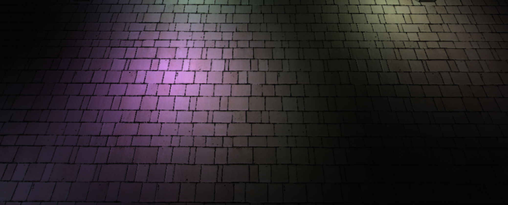

WebGL Clustered and Forward+ Shading
======================

**University of Pennsylvania, CIS 565: GPU Programming and Architecture, Project 5**

* Name: Vaibhav Arcot
  *  [LinkedIn] (https://www.linkedin.com/in/vaibhav-arcot-129829167/)
* Tested on: Windows 10, i7-7700HQ @ 2.8GHz (3.8 Boost) 32GB, External GTX 1080Ti, 11G (My personal laptop)

### Demo Video/GIF

### Live Online

## Overview
This repo contains a WebGL based forward and differed renderer. A live demo of the final results can be found at [this link]( https://black-phoenix.github.io/Project6-WebGL-Clustered-Deferred-Forward-Plus/ ). 
## Method
3 Methods of rendering were implemented. They are explained below
### Forward rendering

Forward rendering is the simplest method of rendering, which works by rasterizing each geometric object in the scene. During the shading process, a list of lights in the scene are iterated over to determine how the geometric objects should be lit. This means that every geometric object has to be considered by every light in the scene. This makes it extremely slow.

### Forward Plus rendering

Forward plus, also known as tiled forward shading uses tiled light culling to reduce the number of lights that must be considered during shading. First, we divide the scene using a uniform grid of tiles in the screen space . We next iterate over the lights in each cluster (not all lights) to shade a tile.  Both opaque and transparent geometry can be handled  using this method without significant loss to performance. 

### Differed rendering

Differed rendering works by rasterizing all of the scene objects (excluding lights) into a series of 2D images buffers (G-buffers) that store the geometric info that required lighting calculations in the last pass. This decouples the light and geometry processing until the last step, making it handle a large number of lights well. Expensive lighting calculations are only computed once per pixel. One disadvantage is that only opaque objects can be rendered using this technique.

### Blinn-Phong reflection
Besides implementing the 3 above mentioned rendering methods, Blinn-Phong reflection were also implemented to better simulate reflections. The core idea is to calculate what is called the halfway vector H (shown below) instead of using the dot product of R (reflected ray) and V (Viewer/eye). 

Once we have H (can be calculated using the equation below), we replace R.V with N.H. This results in a more efficient calculation, making it faster than Phong reflections alone (in certain cases). Below is also a simple comparison with Blinn Phong turned on and off (it might be hard to see the difference because the images are different).

| Phong reflections               | Blinn Phong reflections          |
| ------------------------------- | -------------------------------- |
|  |  |

## Performance analysis

For performance analysis, I decided to take the FPS vs number of lights for different rendering approaches. The plot is shown below. As expected, Forward performs the worst, while Forward+ and clustered perform extremely similarly.

Next, I decided to measure the MS required to render a single frame, shown below.

### Credits

* [Three.js](https://github.com/mrdoob/three.js) by [@mrdoob](https://github.com/mrdoob) and contributors
* [stats.js](https://github.com/mrdoob/stats.js) by [@mrdoob](https://github.com/mrdoob) and contributors
* [webgl-debug](https://github.com/KhronosGroup/WebGLDeveloperTools) by Khronos Group Inc.
* [glMatrix](https://github.com/toji/gl-matrix) by [@toji](https://github.com/toji) and contributors
* [minimal-gltf-loader](https://github.com/shrekshao/minimal-gltf-loader) by [@shrekshao](https://github.com/shrekshao)
